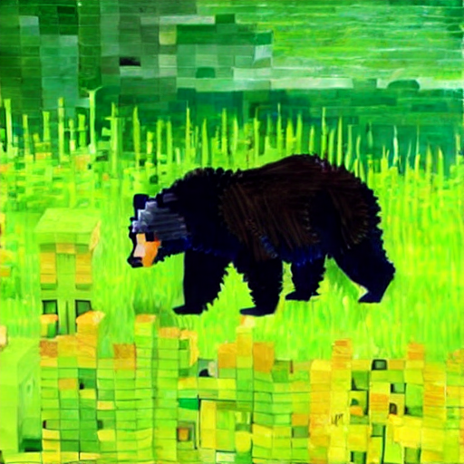
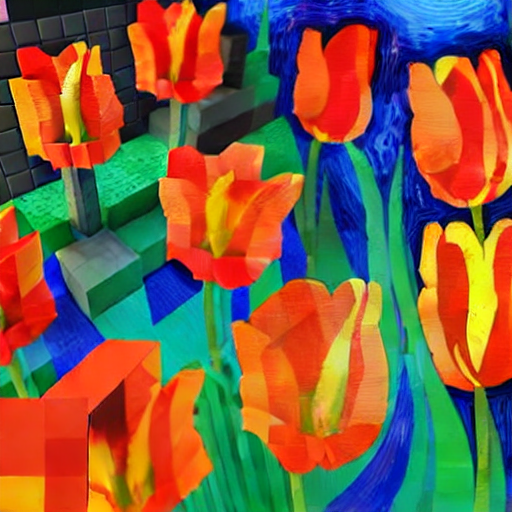
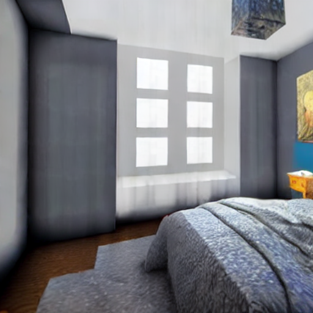
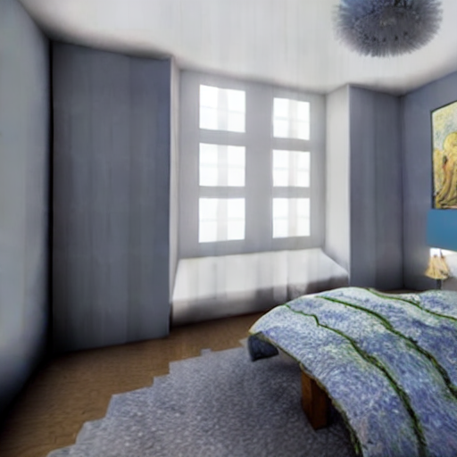

# Seamless Dual-Style Image Generation with Diffusion Models

Project by Adrien Goldszal & Gabriel Mercier for the *Computer Vision : From Fundamentals to Applications* class of Ecole Polytechnique.

One little explored frontier of image generation is blending two different styles seamlessly within a single output. We present two methods based on latent diffusion models that outperform simple text-based prompting: noise spatial interpolation and attention weight interpolation between two style prompts.

|   **Original image**   |        **Epsilon**        |         **Cross-Attention**         |
| :---------------------------: | :------------------------------: | :----------------------------------------: |
|  |  |  |
|  |  |  |
|  |  |  |

**Comparison of style fusion results using Epsilon Interpolation and Cross-Attention Interpolation.**

**Remark**: This project uses **CycleDiffusion** [**[Paper link]**](https://arxiv.org/abs/2210.05559) [**[Repository link]**](https://github.com/ChenWu98/cycle-diffusion?tab=readme-ov-file) as a backbone, a style-transfer and image editing model based on stable-diffusion.

## Repository Structure

This repository has **three branches**, each with one method :

- The base branch `master` is for the baselines : the two prompt concatenation as well as the pixel based interpolation from two individually generated images.
- The branch `epsilon-interpolation` implements the epsilon interpolation between the two output noises of the U-Net
- The branch `crossattention-interpolation` implements the attention weight interpolation inside the U-Net architecture

## Running the code

In each branch, running is defined by the `config` and `data` folder.

- In the `data` folder, the images for style transfer are put in `data/prompt2prompt`, the associated prompts from input and output images are in the `prompts.json`
- The `config`folder defines the task, the `config/experiments/translate_text2img/translate_text2img256_stable_diffusion_stochastic_1.cfg` defines the generation parameters

Running can be done through the following command to be run in terminal :

```shell
export CUDA_VISIBLE_DEVICES=0
export RUN_NAME=translate_text2img256_stable_diffusion_stochastic_1
export SEED=42

python -m torch.distributed.run \
    main.py \
    --seed $SEED \
    --cfg experiments/$RUN_NAME.cfg \
    --run_name $RUN_NAME$SEED \
    --logging_strategy steps \
    --logging_first_step true \
    --logging_steps 4 \
    --evaluation_strategy steps \
    --eval_steps 50 \
    --metric_for_best_model CLIPEnergy \
    --greater_is_better false \
    --load_best_model_at_end \
    --do_eval \
    --output_dir output/$RUN_NAME$SEED \
    --overwrite_output_dir \
    --per_device_train_batch_size 1 \
    --per_device_eval_batch_size 1 \
    --verbose true
```

Produced images and data are stored in the `output` folder.

**Remark** : for the pixel-interpolation baseline on the `master` branch, the two individual images have to be produced and moved to the `Pixel_interpolation` folder. This baseline works by running `interpolate_2_img.py` and correctly defining the styles in the function code.

## Installation Instructions

1. Create an environment by running

```shell
conda env create -f environment.yml
conda activate generative_prompt
pip install git+https://github.com/openai/CLIP.git
```

2. Install `torch` and `torchvision` based on your CUDA version.
3. Install [taming-transformers](https://github.com/CompVis/taming-transformers) by running

```shell
cd ../
git clone git@github.com:CompVis/taming-transformers.git
cd taming-transformers/
pip install -e .
cd ../
```

4. Install Stable Diffusion

```shell
cd ckpts/
mkdir stable_diffusion
cd stable_diffusion/
# Download pre-trained checkpoints for Stable Diffusion here.
# You should download this version: https://huggingface.co/CompVis/stable-diffusion-v-1-4-original
# Due to licence issues, we cannot share the pre-trained checkpoints directly.
```
